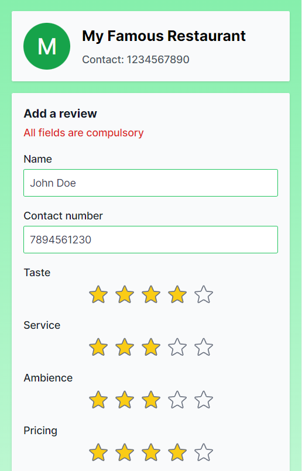

# Sizzle - Restaurant Review and Analytical Platform

Sizzle allows you to supercharge your restaurant using the power of data. Collect reviews from your customers through our platform and analyze customer sentiment and data to grow your business.

## Features

- Visualize and study customer feedback using tabular data and graphical charts
- Understand the key customer metrics and patterns to enhance and grow your business
- Collect real-time customer feedback using QR codes unique to your business
- Send custom notifications to your customers regarding offers and discounts (Coming soon)

## Tech Stack

- Next.js
- Tailwind CSS
- Supabase
- Typescript

## Setup

- Clone the repository
- Install the required dependencies using <code>npm install</code>
- Create a new project in supabase
- Copy the <code>supabase_url</code> and <code>anon_key</code> from the project settings
- Create an .env.local file within your repository and add the following variables: <code>NEXT_PUBLIC_SUPABASE_URL=supabase_url</code> and <code>NEXT_PUBLIC_SUPABASE_KEY=anon_key</code>
- Run the command <code>npm run dev</code> to start the project on <code>localhost:3000</code>
